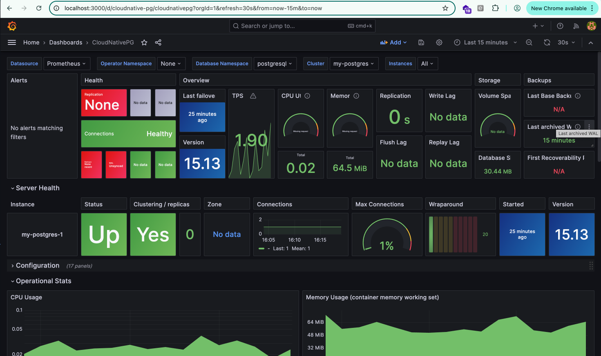

# gitops

## Overview

This repository implements a GitOps workflow for Kubernetes using Flux CD. 

It manages infrastructure, applications, monitoring, and alerting as code. All cluster state is defined in this repository, making Git the single source of truth.

### Architecture

```mermaid
flowchart TD
  subgraph GitHub
    A[Git Repository (apps/base, overlays/dev, clusters, charts, secrets)]
  end

  subgraph FluxCD
    B[Flux Controllers (GitRepository, Kustomization, HelmRelease)]
  end

  subgraph Kubernetes
    C[HelmRelease: kube-prometheus-stack]
    D[HelmRelease: phoenix-app]
    E[CloudNativePG Operator]
    F[Phoenix App Deployment]
    G[Phoenix App Service]
    H[Prometheus Operator]
    I[Grafana]
    J[Alertmanager]
    K[PodMonitor/ServiceMonitor]
    L[Secrets (SOPS)]
  end

  subgraph External
    M[Docker Registry (jaydeepv454/project-phoenix)]
    N[Slack/Webhook/Notification Provider]
  end

  %% GitOps Flow
  A -- Push/PR --> B
  B -- Deploys --> C
  B -- Deploys --> D
  B -- Deploys --> E
  B -- Applies --> L

  %% App Flow
  D -- Uses Image --> M
  D -- Deploys --> F
  D -- Exposes --> G
  F -- Connects to --> E

  %% Monitoring & Alerting
  C -- Installs --> H
  H -- Scrapes --> F
  H -- Scrapes --> E
  H -- Uses --> K
  H -- Feeds --> I
  H -- Feeds --> J
  J -- Sends Alerts --> N

  %% Secrets
  L -- Mounted/Used by --> F
  L -- Mounted/Used by --> E

  %% Dashboard
  I -- Dashboards --> O[User/DevOps]
```

---

## Prerequisites

- [kubectl](https://kubernetes.io/docs/tasks/tools/)
- [Docker (or container runtime)](https://docs.docker.com/engine/install/)
- [kind](https://kind.sigs.k8s.io/) (for local cluster)
- [flux CLI](https://fluxcd.io/docs/installation/)
- [Helm](https://helm.sh/) (for local testing)
- Access to your notification provider (e.g., Slack webhook URL)

---


## Application & Infrastructure Structure

- `apps/base/` — Base Kustomize/Helm definitions for each app (e.g., phoenix-app, hello-world)
- `apps/overlays/` — Environment-specific overlays (e.g., dev)
- `clusters/` — Cluster entrypoints (e.g., dev-cluster)
- `infrastructure/helm-repos/` — HelmRepository definitions for external charts
- `notifications/` — Alerting and notification configuration (not working just playing with it, out of scope from code challange)
- `secrets/` — Encrypted secrets (SOPS)

---

## 1. Create a Kubernetes Cluster

First, create a Kubernetes cluster for testing. We'll use [kind](https://kind.sigs.k8s.io/):

```sh
kind create cluster --name phoenix-demo
```

Verify it’s running:
```sh
kubectl get nodes
```
Kind uses containerized nodes, so it’s fast to create and destroy.

---

## 2. GitOps Engine (FluxCD)

1. **Install FluxCD CLI**:
   ```sh
   brew install fluxcd/tap/flux
   # or see https://fluxcd.io/flux/installation/#prerequisites
   flux check --pre
   ```
2. **Bootstrap Flux into your cluster** pointing at your Git repo:
   ```sh
   export GITHUB_USER=jaydeep
   export GITHUB_TOKEN=<mytoken>

   flux bootstrap github \
     --owner=$GITHUB_USER \
     --repository=gitops \
     --branch=main \
     --path=clusters/dev-cluster \
     --personal
   ```
3. Confirm Flux controllers are running:
   ```sh
   kubectl get pods -n flux-system
   ```
4. In your repo, under `clusters/dev-cluster`, Flux will watch subdirectories for kustomizations and HelmReleases.

---

## 3. Deploy PostgreSQL via CloudNativePG

We use the [CloudNativePG operator](https://artifacthub.io/packages/helm/cloudnative-pg/cloudnative-pg) to provision a PostgreSQL cluster. The operator and cluster manifests are managed in `apps/base/cloudnativepg` and `apps/base/postgres-cluster`.

---

 ** SOPS + Age Setup for Secrets **

   - Encrypt secrets using [SOPS](https://github.com/mozilla/sops) and commit them to the `secrets/` directory.
   -  Generate Age Key:
      ``` 
      age-keygen -o age.key
      export SOPS_AGE_KEY_FILE=./age.key
  - Encrypt a Secret:
      ``` 
      sops -e --encrypted-regex '^(data|stringData)$' -i secrets/dev/cloudnativepg-secret.yaml
      ```


## 4. Monitoring Stack
- Deployed via the [kube-prometheus-stack](https://github.com/prometheus-community/helm-charts/tree/main/charts/kube-prometheus-stack) Helm chart , managed by Flux via a HelmRelease manifest.

- HelmRelease: `apps/base/monitoring/helm-release.yaml`
- HelmRepository: `infrastructure/helm-repos/prometheus-repo.yaml`

- The Prometheus Operator (part of kube-prometheus-stack) automatically discovers and scrapes metrics from CloudNativePG using ServiceMonitor/PodMonitor resources.

- See the section "**Grafana Dashboard Choice rationale**" below for details and justification:
### Prometheus Stack


### Grafana Dashboard Choice rationale


As part of production-grade observability for PostgreSQL clusters managed by [CloudNativePG](https://cloudnative-pg.io/), I integrated [Grafana Dashboard ID 20417](https://grafana.com/grafana/dashboards/20417). 

This dashboard is **officially recommended by the CloudNativePG project** and is tailored to expose the operator's critical runtime metrics.

#### 🔍 Justification

- **Operator-Aware Monitoring**: Unlike generic PostgreSQL dashboards, this one surfaces **CloudNativePG operator-level metrics**, such as replication status, WAL streaming, failover readiness, and instance health — crucial for high availability and disaster recovery.

- **GitOps-Ready Integration**:
  - Included in the GitOps repo as a YAML file at:
    ```text
    apps/base/monitoring/grafana-dashboard-cloudnativepg.yaml
    ```
  - Loaded automatically via **Grafana sidecar dashboards** when using `kube-prometheus-stack`.

- **Native Prometheus Operator Support**:
  - Works seamlessly with Prometheus via `ServiceMonitor` / `PodMonitor` CRDs.
  - Supports metric scraping directly from the CNPG pods and exporter endpoints.

- **Multi-Cluster, Multi-Instance Aware**:
  - Provides per-pod and per-cluster breakdowns.
  - Displays real-time cluster topology, including leader election and streaming replication.

- **Low-Friction Setup**:
  - No manual tweaks required; the dashboard is importable via Grafana.com ID or as a Kubernetes ConfigMap.
  - Tested compatibility with `prometheus-operator` stack and default label selectors.

 
 " When combined with `CloudNativePG`'s `PodMonitor`, `pg_exporter`, and `alerting rules`, this dashboard provides a comprehensive out-of-the-box monitoring setup that adheres to modern DevOps observability standards."

#### 📷 Dashboard Preview

[](https://grafana.com/grafana/dashboards/20417)

---


#### 📁 Dashboard Screenshot


## 5. Application Deployment (not working as they are crating 3 difffent container for css, js ,web)

  - A `Dockerfile` is provided for the Phoenix application, enabling containerized deployment.

  - Build the Docker image and push it to a public container registry (e.g., Docker Hub). The image should be pre-built; a CI pipeline is not required for this challenge.
  - The repository includes a custom Helm chart for the Phoenix application (`apps/base/phoenix-app/chart`).
  - The chart manages a Kubernetes Deployment and Service.
  - It allows configuration via `values.yaml` (e.g., image tag, replica count, database connection details).
  - **Secrets are not hardcoded**; secret management follows best practices using Kubernetes Secrets and SOPS for encryption.
  - The application's Helm chart is committed to the repository and deployed using Flux, ensuring GitOps best practices.

5. **Flux will reconcile and apply all manifests automatically.**
or sync via 


## Phoenix App Helm Chart: Configurable Values

Located in `apps/base/phoenix-app/chart/values.yaml`:

```yaml
replicaCount: 2

image:
  repository: jaydeepv454/project-phoenix
  tag: "1.1"
  pullPolicy: IfNotPresent

service:
  type: ClusterIP
  port: 80
  targetPort: 8000

resources:
  limits:
    cpu: 250m
    memory: 256Mi
  requests:
    cpu: 100m
    memory: 128Mi

config:
  DOCKER_RESTART_POLICY: "no"
  DOCKER_WEB_HEALTHCHECK_TEST: "/bin/true"
  DOCKER_WEB_PORT_FORWARD: "8000"
  DOCKER_WEB_VOLUME: ".:/app"
  MIX_ENV: "dev"
  NODE_ENV: "development"
  URL_SCHEME: "http"
  URL_HOST: "localhost"
  URL_PORT: "8000"

secretRef: phoenix-secret
```


### Alerting: Pod Not Ready

- **PrometheusRule:** `apps/base/monitoring/alert-if-pod-not-ready.yaml`
- **Rule:** Triggers an alert if any pod is not in a Ready state for more than 1 minute.

```yaml
- alert: PodNotReady
  expr: kube_pod_status_ready{condition="true"} == 0
  for: 1m
  labels:
    severity: warning
  annotations:
    summary: "Pod {{ $labels.namespace }}/{{ $labels.pod }} is not ready"
    description: "Pod has not been ready for more than 1 minute."
```

### Alertmanager Configuration

- **File:** `apps/base/monitoring/alertmanager-config.yaml`
- **Sends notifications via webhook to a receiver (e.g., Slack, Discord, etc.)**

```yaml
receivers:
  - name: webhook-receiver
    webhook_configs:
      - url: "http://alert-webhook.monitoring.svc.cluster.local:5000/"
        send_resolved: true
```

### Slack Notification Provider

- **Provider:** `notifications/slack/alert-provider.yaml`
- **Receiver:** `notifications/slack/receiver.yaml`
- **Alert:** `notifications/slack/alert.yaml`
- **Secret:** `secrets/slack-webhook-secret.yaml`

---

## How to Set Up and Test Alerting

1. **Configure your Slack webhook and secret as described above.**
2. **Ensure Alertmanager is configured with the correct webhook URL.**
3. **Deploy the PrometheusRule for pod readiness.**
4. **Test:** Simulate a pod failure (e.g., scale a deployment to 0 or delete a pod) and verify a notification is sent to your Slack channel.

---

## GitOps Principles & Best Practices (As requested)

- **Single Source of Truth:** All cluster and app configuration is managed in Git.
- **Idempotency:** All manifests and Helm charts are designed to be safely reapplied.
- **Configuration as Code:** Everything, including secrets (encrypted), is versioned.
- **Clarity:** Directory structure and documentation are clear and modular.
- **Best Practices:** Resource requests/limits, secret management, and Helm chart structure follow industry standards.

---